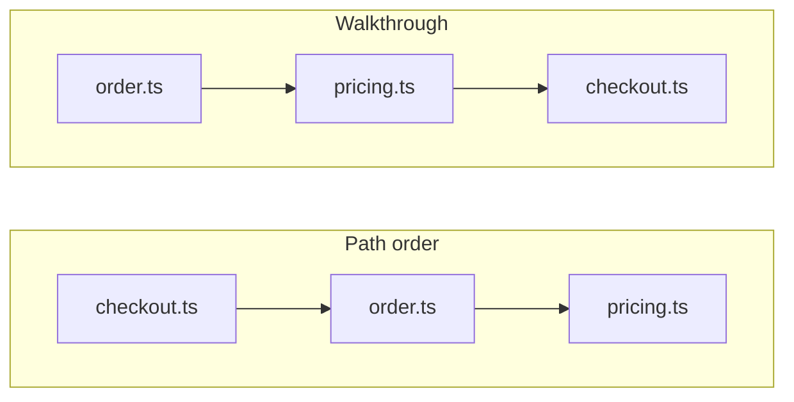

# Tabthrough

Understand a code change one Tab at a time. Tabthrough is a guided diff reader for VS Code and Cursor: it walks your working changes, a commit, or a commit range in explanation order — types before callers, not the file list git gives you. It works offline, needs no account, and does not find bugs or write review comments.

- **Offline.** Heuristic order and sidecar guides run with no network, account, or API key.
- **One Tab, one thought.** The native diff editor shows the change so far. Later lines stay hidden until you advance.
- **Author's path.** A `.tabthrough.{topic}.guide.json` sidecar replaces the heuristic with intended order and notes. A broken guide falls back with one warning.
- **Plain git.** Read-only review does not move `HEAD` or stash. Rebase mode is a stopped `git rebase -i`. Worktree mode is not shipped.
- **Idle sidebar.** Recent commits, working changes when the checkout is dirty, and remote/branch selectors. Pick a remote branch to review a PR without checking it out. One-click GitHub or GitLab PR lists are not shipped.

```json
{
  "$schema": "https://raw.githubusercontent.com/artalar/tabthrough/main/schema/guide-v1.json",
  "version": 1,
  "topic": "order-type",
  "steps": [
    { "id": "order", "path": "src/order.ts", "title": "An order has named fields", "rationale": "The contract before its consumers" },
    { "id": "pricing", "path": "src/pricing.ts", "title": "Pricing consumes the contract", "rationale": "Behavior before the last caller" },
    { "id": "checkout", "path": "src/checkout.ts", "title": "Checkout names its inputs", "rationale": "The caller after the type and the math" }
  ]
}
```

Path order would open `checkout.ts` first. The guide opens the contract first.



- [Install](#install)
- [Walk a change](#walk-a-change)
- [Author a guide](#author-a-guide)
- [Limitations](#limitations)
- [Configurations](#configurations)
- [Commands](#commands)
- [Contributing](#contributing)

---

## Install

There is no Marketplace listing yet. Sideload the VSIX. The packaging toolchain needs **Node 24** (`vsce` crashes on Node 25). The folder must be a **trusted** git repository — Tabthrough runs git and refuses untrusted or virtual workspaces.

**Cursor**, from this repo:

```bash
pnpm install --frozen-lockfile
pnpm ext:install
```

Reload the window if the extension was already open.

**VS Code**, or a VSIX you pass around:

```bash
pnpm install --frozen-lockfile
pnpm build
# If you use mise:
mise exec node@24 -- pnpm ext:package
# Otherwise, with Node 24 on PATH:
pnpm ext:package
code --install-extension tabthrough-0.0.0.vsix
```

Requires VS Code 1.97 or later.

### Try a disposable demo

```bash
node scripts/create-demo.mjs
```

Open the printed folder, run **Tabthrough: Review Working Changes**, start the walkthrough, and press **Tab**. The demo walks from an order type to its calculation and caller. It creates a new temporary repository each time; it does not change this project. The demo still ships the legacy `.guide.json` name, which Tabthrough still reads.

---

## Walk a change

1. Open the Walkthrough sidebar (activity bar, or **Tabthrough: Show Walkthrough**). The first screen lists recent commits, working changes when the checkout is dirty, and remote/branch selectors.
2. Click a commit to select it; a second click sets a range (Start/End). With nothing picked, **Review** walks the selected branch against the default base (`upstream`, else `origin`, then local `main`/`master`).
3. The header has a type selector before **Review**. It defaults to **Ask editor agent**. **Review** runs that type: agent handoff, Simple guide, Read-only, or Rebase. Dirty buffers are saved before a working-tree snapshot; a failed save stops the review.
4. Read the current thought and press **Tab** (or **Next** in the sidebar).

The sidebar shows **Will run:** before Start. Read-only prints **nothing** — it does not check out or stash.

| Mode | What git does | Edit here | Status |
|------|----------------|-----------|--------|
| Read-only | Snapshot ref for working changes; commit and range touch nothing | Working-tree review: opens the real file | Landed |
| Rebase | `git rebase -i --autostash` stopped at the reviewed commit. Commit or range on the current branch only — working changes stay read-only | Opens the real file. Finish amends and `--continue`; Cancel is `--abort` | Landed |
| Worktree | Detached worktree in a new window | In that window | Not shipped |

| Key | Action |
|-----|--------|
| **Tab** / **Alt+]** | Next thought |
| **Shift+Tab** / **Alt+[** | Previous thought |
| **Alt+Enter** | Edit here (review document focused) |

Tab still indents in real file editors. Turn off `tabthrough.keybinding.useTab` to keep only the Alt shortcuts. Tabthrough never creates a commit for you.

A rebase, merge, or leftover autostash started in a terminal shows in the sidebar with **Continue**, **Abort**, **Pop**, and the other named git buttons. Their output goes to the Tabthrough channel.

---

## Author a guide

If the change already ships a sidecar, its order and notes replace the offline heuristic.

| File | When |
|------|------|
| `.tabthrough.{topic}.guide.json` | Current name. Kebab topic in the filename; include matching `"topic"`. |
| `.tabthrough-guide.json` | Fallback when no topic file is focused (`tabthrough.guideFile`). |
| `.guide.json` | Legacy name, still read. |

**Tabthrough: Install /tabthrough Skill** copies the authoring skill into the workspace so an agent can emit the sidecar with the change.

Malformed guides never block a review: every failure falls back to the heuristic with one warning.

- Schema: [`schema/guide-v1.json`](schema/guide-v1.json)
- Authoring: [`work-docs/guides/agent-guide-authoring.md`](work-docs/guides/agent-guide-authoring.md)
- Skill: [`.agents/skills/tabthrough/SKILL.md`](.agents/skills/tabthrough/SKILL.md)

---

## Limitations

| Limitation | Today |
|------------|--------|
| **Marketplace / Open VSX** | Not published — sideload the VSIX |
| **One-click remote PR lists** | Pick a remote branch in the sidebar |
| **Worktree mode** | Setting exists; the mode is not shipped |
| **Rebase on working changes** | Not offered — the tree already holds the change; use read-only and Edit here |
| **Multi-root workspaces** | First folder's repository only |
| **Shallow clones missing parents** | Refused, with a fetch hint |
| **Binary / rename / mode / symlink / generated** | Stub steps; Edit here is for text files |
| **Whitespace-only diffs** | Start refused |
| **Rebase / merge / cherry-pick already in progress** | Start still works in read-only; the sidebar shows git's state |

Git internals and the session design: [`work-docs/architecture/overview.md`](work-docs/architecture/overview.md).

---

## Configurations

<!-- configs -->

| Key                              | Description                                                                                                                      | Type      | Default                    |
| -------------------------------- | -------------------------------------------------------------------------------------------------------------------------------- | --------- | -------------------------- |
| `tabthrough.showRationale`       | Show the one-line reason each step was ordered where it is (for example "types before callers") in the status bar.               | `boolean` | `true`                     |
| `tabthrough.reveal.mode`         | How the reviewed change is revealed as you advance through steps.                                                                | `string`  | `"progressive"`            |
| `tabthrough.session.mode`        | Which git primitive a session uses. Read-only and rebase are landed; worktree comes later.                                       | `string`  | `"ask"`                    |
| `tabthrough.finish.hooks`        | Run git hooks (pre-rebase, pre-commit, commit-msg) when starting and finishing a rebase review. Off by default.                  | `boolean` | `false`                    |
| `tabthrough.finish.sign`         | GPG-sign the amended commit and replayed commits. Off by default; replayed commits stay unsigned unless this is on.              | `boolean` | `false`                    |
| `tabthrough.guideFile`           | Fallback sidecar path when no .tabthrough.{topic}.guide.json is focused. Generated reviews write .tabthrough.{topic}.guide.json. | `string`  | `".tabthrough-guide.json"` |
| `tabthrough.keybinding.useTab`   | Bind Tab to the next review step while a review document is focused. Alt+] and Alt+[ always work regardless of this setting.     | `boolean` | `true`                     |
| `tabthrough.maxLinesPerStep`     | Upper bound on how many low-significance changed lines are coalesced into a single step.                                         | `number`  | `24`                       |
| `tabthrough.hideFormattingSteps` | Drop steps whose changes are whitespace or comments only.                                                                        | `boolean` | `false`                    |
| `tabthrough.worktree.dir`        | Root directory for Tabthrough worktrees. Empty uses the OS temp directory under tabthrough/.                                     | `string`  | `""`                       |

<!-- configs -->

## Commands

<!-- commands -->

| Command                        | Title                                         |
| ------------------------------ | --------------------------------------------- |
| `tabthrough.review`            | Tabthrough: Review…                           |
| `tabthrough.start`             | Tabthrough: Review Working Changes            |
| `tabthrough.startFromCommit`   | Tabthrough: Review a Commit...                |
| `tabthrough.startFromRange`    | Tabthrough: Review a Commit Range...          |
| `tabthrough.startFromGuide`    | Tabthrough: Start Walkthrough from This Guide |
| `tabthrough.installSkill`      | Tabthrough: Install /tabthrough Skill         |
| `tabthrough.pickWorkingTree`   | Tabthrough: Pick Working Changes              |
| `tabthrough.pickCommit`        | Tabthrough: Pick a Commit                     |
| `tabthrough.pickRange`         | Tabthrough: Pick a Commit Range               |
| `tabthrough.selectHomeRev`     | Tabthrough: Select Home Revision              |
| `tabthrough.setRemote`         | Tabthrough: Set Remote                        |
| `tabthrough.setBranch`         | Tabthrough: Set Branch                        |
| `tabthrough.fetchRemote`       | Tabthrough: Fetch Remote                      |
| `tabthrough.reviewSelection`   | Tabthrough: Review Selection                  |
| `tabthrough.setHomeReviewKind` | Tabthrough: Set Home Review Type              |
| `tabthrough.selectCommit`      | Tabthrough: Select Commit                     |
| `tabthrough.submitRange`       | Tabthrough: Use Commit Range                  |
| `tabthrough.setGuideTopic`     | Tabthrough: Set Guide Topic                   |
| `tabthrough.generateSimple`    | Tabthrough: Generate Simple Guide             |
| `tabthrough.generateAgent`     | Tabthrough: Ask Editor Agent                  |
| `tabthrough.setupBack`         | Tabthrough: Back                              |
| `tabthrough.chooseMode`        | Tabthrough: Choose Session Mode               |
| `tabthrough.next`              | Tabthrough: Reveal Next Change                |
| `tabthrough.previous`          | Tabthrough: Go Back One Change                |
| `tabthrough.showStepDetail`    | Tabthrough: Go to Current Change              |
| `tabthrough.showWalkthrough`   | Tabthrough: Show Walkthrough                  |
| `tabthrough.finish`            | Tabthrough: Finish Walkthrough                |
| `tabthrough.cancel`            | Tabthrough: End Walkthrough                   |
| `tabthrough.commitHandoff`     | Tabthrough: Open Source Control               |
| `tabthrough.editHere`          | Tabthrough: Edit Here                         |
| `tabthrough.continueRebase`    | Tabthrough: Continue Rebase                   |
| `tabthrough.abortRebase`       | Tabthrough: Abort Rebase                      |
| `tabthrough.popAutostash`      | Tabthrough: Pop Autostash                     |
| `tabthrough.showAutostash`     | Tabthrough: Show Autostash                    |
| `tabthrough.openWorktree`      | Tabthrough: Open Worktree                     |
| `tabthrough.removeWorktree`    | Tabthrough: Remove Worktree                   |
| `tabthrough.pruneWorktrees`    | Tabthrough: Prune Worktrees                   |
| `tabthrough.openConflict`      | Tabthrough: Open Conflicted File              |

<!-- commands -->

## Contributing

```bash
pnpm install
pnpm lint && pnpm typecheck && pnpm test:ci
```

The git, guide, and model layers never import `vscode`, so those suites run under plain vitest. Design docs live under [`work-docs/`](work-docs/). Built on [Reatom](https://v1001.reatom.dev) and [reactive-vscode](https://kermanx.github.io/reactive-vscode/).

## License

[MIT](./LICENSE.md) © 2026 [Arutyunyan Artem](https://github.com/artalar)
